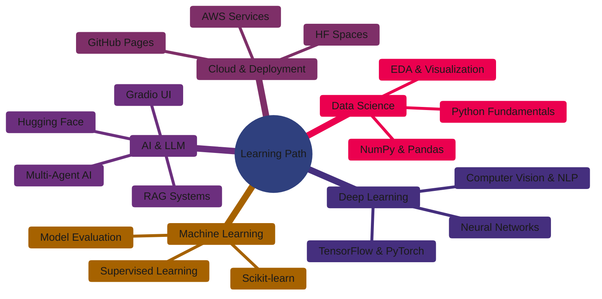

<div align="center">
  
</div>

<div align="center">
  
  [](https://git.io/typing-svg)
  
</div>

<div align="center">
  
  [](https://linkedin.com/in/shivprasad-supane-9b108a367)
  [](mailto:shiv.supane777@gmail.com)
  
  
  
</div>

---

### 👨‍💻 About Me

```yaml
name: Shivprasad Supane
located_in: Pune, Maharashtra, India
current_role: Data Science & AI Learner | ML Engineer (in progress)
education:
  - "Full-time CS Student"
  - "90-Day Data Science Roadmap — Zero to Hero"
  - "Pursuing: Anthropic Certificate | DeepLearning.AI RAG | Cisco Data Analytics"

interests: ["Machine Learning", "Deep Learning", "LLM & RAG Systems", "Data Science", "Cloud AI (AWS)"]
currently_learning: ["Python → Data Science → ML → Hugging Face → Gradio → RAG → Multi-Agent AI"]
fun_fact: "I follow one rule — Finish one thing completely before touching the next. Depth > Speed."

daily_routine: ["☕ Coffee", "💻 Code", "📊 Data", "🤖 AI", "🔁 Repeat"]
```


### 🚀 What I'm Up To

- 🔭 Building AI/ML projects including **LLM, RAG, and multi-agent systems** with cloud integration

- 🌱 Currently learning **Machine Learning, Deep Learning, Data Science, Hugging Face, and Cloud (AWS)**
  
- 👯 Looking to collaborate on **AI/ML, Data Science, and open-source projects** involving real-world problem solving
  
- 🆘 Looking for help with **advanced AI architectures, scalable deployments, and optimizing ML models**
  
- 💬 Ask me about **Python, Data Analysis, Cloud Computing-AWS, AI projects, and ML concepts**
  
- ⚡ I have a strong execution mindset — **I focus on completing what I start**

---

### 🛠️ Tech Stack & Tools

<div align="center">

#### 🤖 AI / ML / Deep Learning


#### 📊 Data Science & Analysis


#### ☁️ Cloud Platform


#### 💻 Programming & Scripting


#### 🌐 Frameworks & APIs


#### 🗄️ Databases


#### 🐧 Operating Systems & Servers


#### 🎨 Design & Tools


#### 🔐 Version Control


</div>

---

### 📊 GitHub Statistics

<div align="center">
  
  
</div>

<div align="center">
  
  
</div>

---

### 📈 Contribution Graph

<div align="center">
  
</div>

---

### 📚 Currently Learning

<div align="center">



</div>

---

### 📫 Let's Connect!

<div align="center">
  
  [](https://linkedin.com/in/shivprasad-supane-9b108a367)
  [](https://twitter.com/)
  [](https://instagram.com/)
  [](https://youtube.com/)
  [](mailto:shiv.supane777@gmail.com)
  
</div>

---

### 💡 Random Dev Quote

<div align="center">
  


</div>

---

### 🐍 Contribution Snake

<div align="center">
  
</div>

---

<div align="center">
  
  ### 💭 My Motto
  
  > **"One thing at a time. Finish → Then move. Depth over Speed."**
  
  *Building AI solutions one complete step at a time.*
  
  ---
  
  **⭐ From [ShivSupane](https://github.com/ShivSupane) with 🤖 and ☕**
  
  
  
</div>
